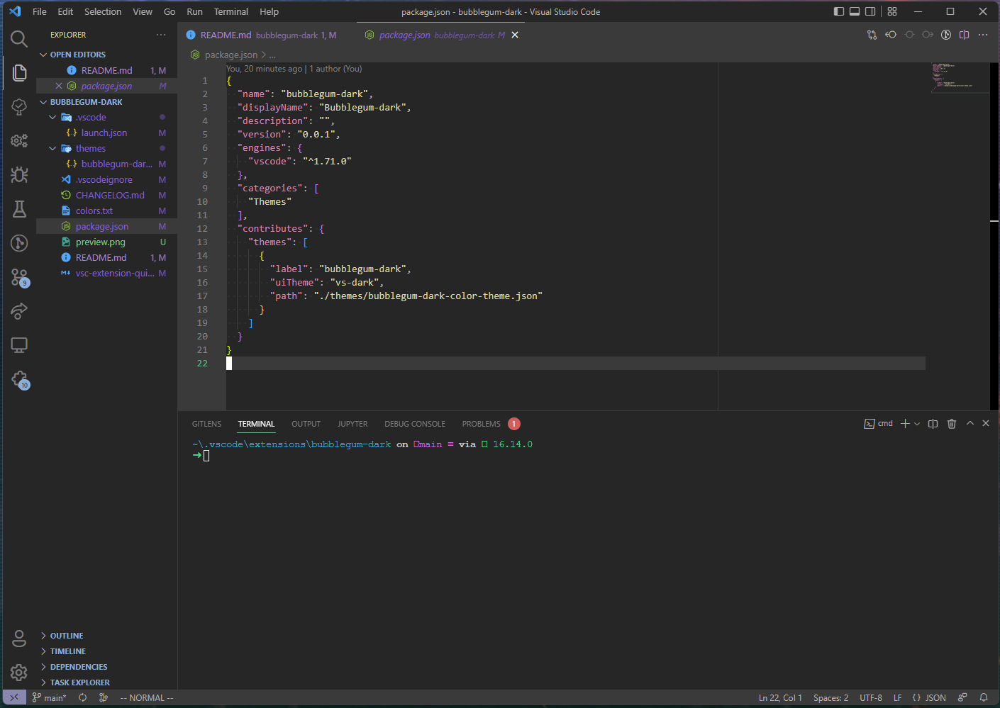

# bubblegum-dark

A Visual Studio Code theme based on [baskerville/bubblegum](https://github.com/baskerville/bubblegum) (dark mode only)

## Usage:
1. Clone this repo into your `~/.vscode/extensions/` folder.
2. Select the `bubblegum dark` theme from the vscode ui
